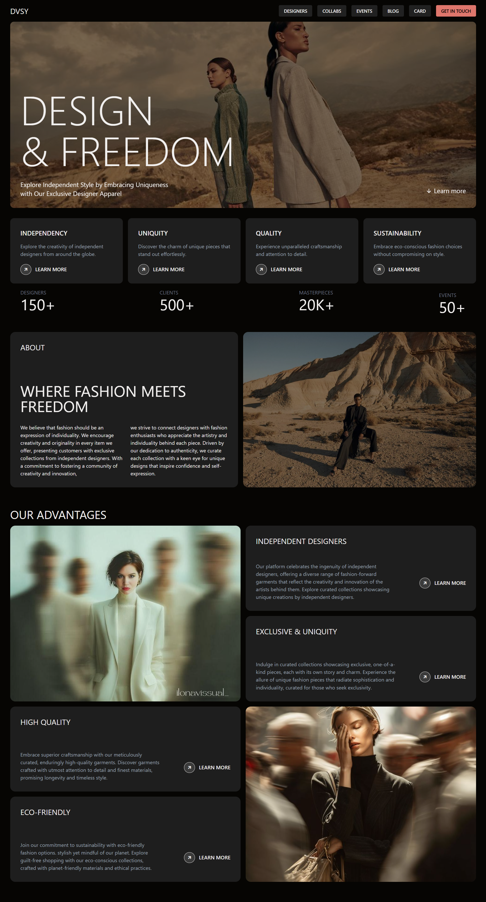

# 📸 Fashion Design Website (React + Vite)

- Live Demo: [https://react8fashion.netlify.app/](https://react8fashion.netlify.app/)
- Repo: [https://github.com/Dileep-kumawat/Fashion-Design-website-using-React.git](https://github.com/Dileep-kumawat/Fashion-Design-website-using-React.git)

---

## 📸 Preview



---

## 🎥 Demo Video

🔗 **Watch the Demo:** [click to watch](https://youtu.be/CD-TMEdWM8Y)

---

## 🚀 Overview

This is a **modern, responsive fashion website** built using **React and Vite**. It showcases a clean UI for browsing fashion products and is designed with real-world usability in mind - not just tutorial code.

This project is *more than boilerplate* - it reflects how to structure a scalable frontend, organize components, manage routes, and deliver a production-ready build.

---

## 📌 Features

✔️ React with Vite for blazing-fast dev experience
✔ Responsive layouts for desktop and mobile
✔ Clean, styled UI Tailwind css
✔ Navigation bar with curated fashion categories
✔ Product listing & detail views
✔ Smooth transitions and interactive UX
✔ Deployed live on Netlify

---

## 📦 Tech Stack

| Technology                             | Purpose                  |
| -------------------------------------- | ------------------------ |
| **React**                              | UI components            |
| **Vite**                               | Fast build & dev tooling |
| **React Router**                       | Client-side routing      |
| **CSS / Tailwind / Styled Components** | Styling & layout         |
| **Netlify**                            | Deployment               |

---

## 🛠️ Installation

### Clone

```bash
git clone https://github.com/Dileep-kumawat/Fashion-Design-website-using-React.git
```

### Setup

```bash
cd Fashion-Design-website-using-React
npm install
```

### Run Locally

```bash
npm run dev
```

Visit `http://localhost:5173` to preview the app locally.

### Build for Production

```bash
npm run build
```

This creates an optimized production build ready for deployment.

---

## 🧠 Project Structure

```
├── public/ … static assets
├── src/
│   ├── components/ … reusable UI pieces
│   ├── pages/ … route pages
│   ├── styles/ … global CSS
│   ├── App.jsx
│   └── main.jsx
├── package.json
└── vite.config.js
```


---

## 📌 Usage

Describe how users interact with your site:

* Browse the latest fashion collections
* Click items to view details
* Navigate between categories
* (If there’s a cart or wishlist) Add/remove items

---

## 📍 Deployment

The site is deployed using **Netlify** and automatically updates on commits to the `main` branch.

Live link: [https://react8fashion.netlify.app/](https://react8fashion.netlify.app/)

---

## 🛠️ What You’ll Learn Here

This codebase demonstrates:

* Scalable React component structure
* Routing with React Router
* Responsive CSS best practices
* Build & deployment via Vite + Netlify
* Clean, reusable UI design

These are exactly the skills employers look for on front-end portfolios. 
---

## 🙌 Contributing

Contributions are welcome! If you want to:

* Add features (cart, search, filtering, authentication)
* Improve styling or animations
* Refactor for state management (Redux/Context)

…create a pull request or open an issue.

---

## 💡 Author

Built by **Dileep**
🔥 Passionate Frontend & Full-Stack Developer

- 📧 [dileepkumawat525@gmail.com](mailto:dileepkumawat525@gmail.com)
- 🔗 [LinkedIn](https://www.linkedin.com/in/dileep-kumawat/)

---

## 📄 License

This project is **MIT licensed** - you’re free to use it in your own work.